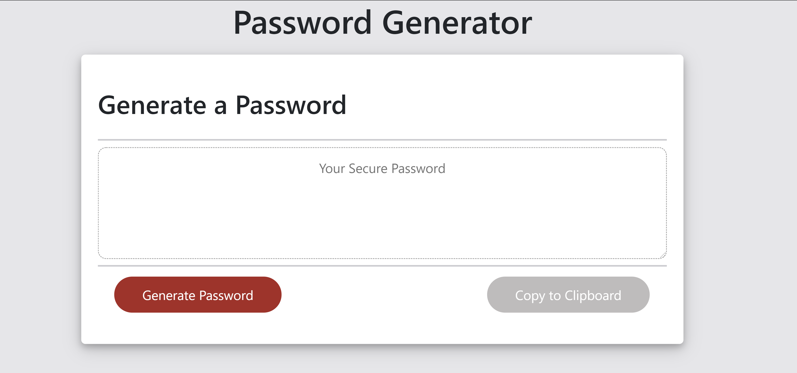

# Password Generator

#### Purpose

The purpose of this project is to use function to manipulate the password length that the user chose as well as the different combinations of characer types that the user must choose and create a function that generate a password. On top of that, we also must understand how to link different files to html and call function when necessary. Also we must understand how to set the size of the page so it fit in any screen resolution. Lastly, we must create another function to copy the generated password to clipboard and link it in html through the function name. 

#### Functionality

The function of this project is to create a password generator with different character length ranging form 8-128 that the user can choose from as well as different characer types that the user must choose in order to generate a password of their liking.

Character types includes:
*Special characters 
*Numeric characters
*Lowercase characters
*Uppercase characters

Link to github page: https://github.com/ductran963/passwordGenerator

Password Generator image:

-  `#Blue`
